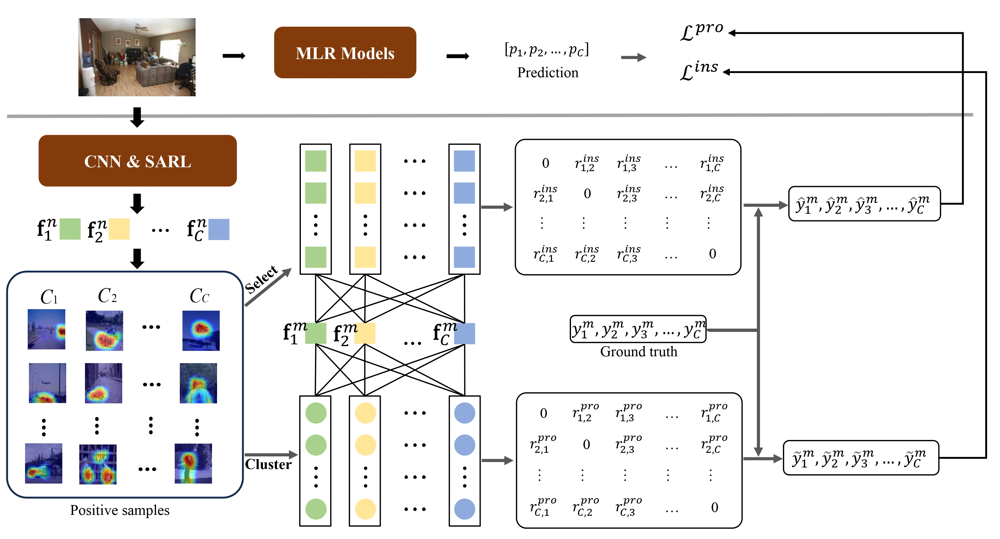

# Multi-Label Confidence Calibration

Official Implementation of our paper: 

- Tianshui Chen, Weihang Wang, Tao Pu, Jinghui Qin, Zhijing Yang, Jie Liu, Liang Lin
  [DCLR: Dynamic Correlation Learning and Regularization for Multi-Label Confidence Calibration](http://arxiv.org/abs/2407.06844)
  IEEE Transactions on Image Processing
  



## Requirements
We run the code with torch version: 1.11.0, python version: 3.9.7

The detailed requirements is in ``requirements.txt``. Please use the 
```bash
pip install -r requirements.txt
```
pip install command to install it.

## Datasets
Our method works for COCO and VG datasets, please modify your ``dataset path`` under ``config/dataset``.
If you want to use your own dataset, you can configure it by copying the dataset writeup under the ``config/dataset``.
Afterwards, specify your dataset on the command line using the ``-dataset`` parameter. See the ``config`` and ``scripts`` folders for details on how to configure it.

## Usage
```bash
# SSGRL module on COCO dataset:
bash scripts/SSGRL_COCO_Calibration.sh

# MLGCN module on COCO dataset: 
bash scripts/MLGCN_COCO_Calibration.sh

# CTran module on COCO dataset:
bash scriptsMLGCN_COCO_Calibration.sh
```

## Citation

```
@article{chen2024dynamic,
  title={Dynamic Correlation Learning and Regularization for Multi-Label Confidence Calibration},
  author={Chen, Tianshui and Wang, Weihang and Pu, Tao and Qin, Jinghui and Yang, Zhijing and Liu, Jie and Lin, Liang},
  journal={IEEE Transactions on Image Processing},
  year={2024}
}
```

## Contact
If you have any questions for our paper or codes, please send an email to wwkml994@gmail.com or tianshuichen@gmail.com.
