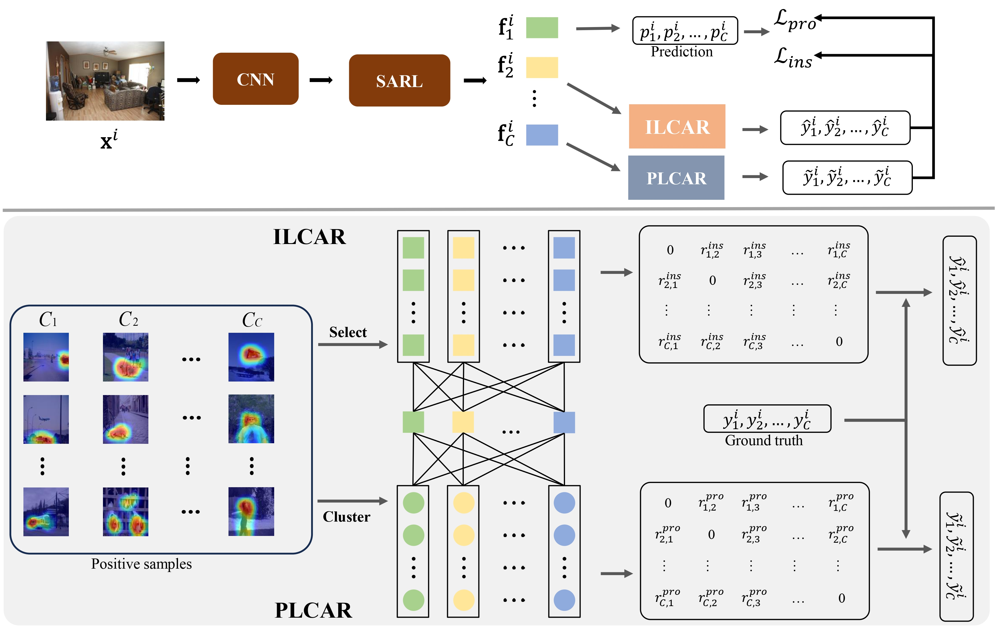

# DPCAR - Official PyTorch Implementation
PyTorch implementation of our Dual-Perspective Correlation-Aware Regularization for Multi-Label Confidence Calibration.



## Requirements
We run the code with torch version: 1.11.0, python version: 3.9.7

The detailed requirements is in ``requirements.txt``. Please use the 
```bash
pip install -r requirements.txt
```
pip install command to install it.

## Usage
SSGRL module on COCO dataset:
```python
cd scripts
bash SSGRL_COCO_Calibration.sh
```

MLGCN module on COCO dataset:
```python
cd scripts
bash MLGCN_COCO_Calibration.sh
```

CTran module on COCO dataset:
```python
cd scripts
bash CTran_COCO_Calibration.sh
```

## Contact
If you have any questions for our paper or codes, please send an email to wwkml994@gmail.com


<!-- ## Citing this repository
If you find this code useful in your research, please consider citing us: -->

